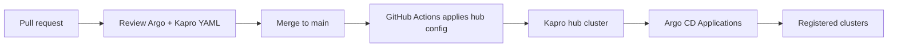

# Kapro Example: Argo Hub Config Repository

This repository shows the recommended source-of-truth layout for introducing
Kapro into an existing Argo CD hub. Argo CD remains the sync engine; Kapro adds
promotion policy, waves, approvals, and release status.



## Layout

```text
clusters/   fleet inventory
backends/   Argo BackendProfile in observe mode
sources/    PromotionSource mappings for Argo Applications and generator files
argocd/     Existing Argo Application/ApplicationSet examples
pipelines/  progressive rollout plans
releases/   promotion intents
approvals/  manual approval examples
```

## Local Validation

```bash
bash scripts/validate.sh
```

## Apply Order

```bash
kubectl apply -f clusters/
kubectl apply -f backends/
kubectl apply -f sources/
kubectl apply -f pipelines/
kubectl apply -f releases/
```

Approvals are normally created by a human or approval service only when a
release is waiting.

Use `kapro adopt argo . --out kapro-connect --name checkout` to regenerate the
BackendProfile and PromotionSource from the Argo files in this repo.
