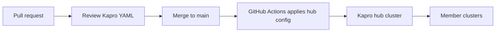

# Kapro Example: Hub Config Repository

This repository shows the recommended source-of-truth layout for a Kapro hub.



## Layout

```text
clusters/   fleet inventory
bundles/    reusable component bundles
pipelines/  progressive rollout plans
releases/   promotion intents
approvals/  manual approval examples
```

## Local Validation

```bash
bash scripts/validate.sh
```

## Apply Order

```bash
kubectl apply -f clusters/
kubectl apply -f bundles/
kubectl apply -f pipelines/
kubectl apply -f releases/
```

Approvals are normally created by a human or approval service only when a
release is waiting.

